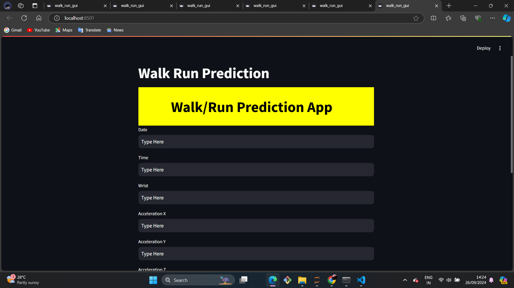

# Walk-Run-Prediction
Here’s a detailed README template tailored to the provided file and accompanying assets for a repository named `WalkRun Prediction`.

---

# WalkRun Prediction

This repository provides a project to classify or predict walking and running activities using machine learning. The project includes a trained model, a Streamlit application for interactive usage, and a related image for visual representation.

---

## Files in the Repository

1. **`walk_Run.ipynb`**:  
   A Jupyter Notebook containing the entire workflow for the project, including:
   - Data loading and preprocessing
   - Feature engineering
   - Model training and evaluation

2. **`model.pkl`**:  
   A serialized file containing the trained machine learning model for activity classification.

3. **`app.py`**:  
   A Streamlit application for providing a user-friendly interface to interact with the model.

4. **Image**:  
   - `walk_run.png`: An image showcasing the results or a visualization of the dataset.

---

## How to Use

### Prerequisites

Make sure you have the following installed:
- Python 3.x
- Required libraries listed in `requirements.txt`

Install the dependencies with:
```bash
pip install -r requirements.txt
```

### Running the Application

1. Clone the repository:
   ```bash
   git clone https://github.com/rishi146196/WalkRun-Prediction.git
   cd WalkRun-Prediction
   ```

2. Launch the Streamlit app:
   ```bash
   streamlit run app.py
   ```

3. Access the application in your browser via the link displayed in the terminal.

---

## Project Workflow

1. **Data Processing**:  
   The notebook processes raw data, extracts relevant features, and prepares it for model training.

2. **Model Training**:  
   A machine learning model is trained and saved as `model.pkl` for reuse.

3. **Deployment**:  
   A Streamlit app is provided to load the model and make predictions in an interactive web environment.

---

## Example



*Prediction example or visualization.*

---

## Contributing

We welcome contributions to this project! If you'd like to add features or fix bugs, please create a pull request or open an issue.

---

